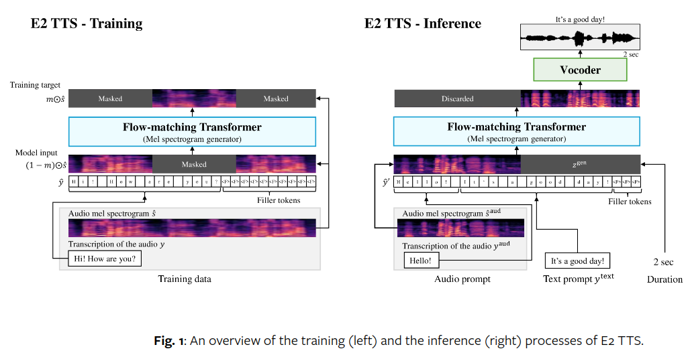

</img>

## E2 TTS - Pytorch

Implementation of E2-TTS, <a href="https://arxiv.org/abs/2406.18009v1">Embarrassingly Easy Fully Non-Autoregressive Zero-Shot TTS</a>, in Pytorch

## Appreciation

- <a href="https://github.com/manmay-nakhashi">Manmay</a> for contributing <a href="https://github.com/lucidrains/e2-tts-pytorch/pull/1">working end-to-end training code</a>!

## Install

```bash
$ pip install e2-tts-pytorch
```

## Usage

```python
import torch

from e2_tts_pytorch import (
    E2TTS,
    DurationPredictor
)

duration_predictor = DurationPredictor(
    transformer = dict(
        dim = 512,
        depth = 8,
    )
)

mel = torch.randn(2, 1024, 100)
text = ['Hello', 'Goodbye']

loss = duration_predictor(mel, text = text)
loss.backward()

e2tts = E2TTS(
    duration_predictor = duration_predictor,
    transformer = dict(
        dim = 512,
        depth = 8,
        skip_connect_type = 'concat'
    ),
)

out = e2tts(mel, text = text)
out.loss.backward()

sampled = e2tts.sample(mel[:, :5], text = text)

```

## Citations

```bibtex
@inproceedings{Eskimez2024E2TE,
    title   = {E2 TTS: Embarrassingly Easy Fully Non-Autoregressive Zero-Shot TTS},
    author  = {Sefik Emre Eskimez and Xiaofei Wang and Manthan Thakker and Canrun Li and Chung-Hsien Tsai and Zhen Xiao and Hemin Yang and Zirun Zhu and Min Tang and Xu Tan and Yanqing Liu and Sheng Zhao and Naoyuki Kanda},
    year    = {2024},
    url     = {https://api.semanticscholar.org/CorpusID:270738197}
}
```

```bibtex
@inproceedings{Darcet2023VisionTN,
    title   = {Vision Transformers Need Registers},
    author  = {Timoth'ee Darcet and Maxime Oquab and Julien Mairal and Piotr Bojanowski},
    year    = {2023},
    url     = {https://api.semanticscholar.org/CorpusID:263134283}
}
```

```bibtex
@article{Bao2022AllAW,
    title   = {All are Worth Words: A ViT Backbone for Diffusion Models},
    author  = {Fan Bao and Shen Nie and Kaiwen Xue and Yue Cao and Chongxuan Li and Hang Su and Jun Zhu},
    journal = {2023 IEEE/CVF Conference on Computer Vision and Pattern Recognition (CVPR)},
    year    = {2022},
    pages   = {22669-22679},
    url     = {https://api.semanticscholar.org/CorpusID:253581703}
}
```
